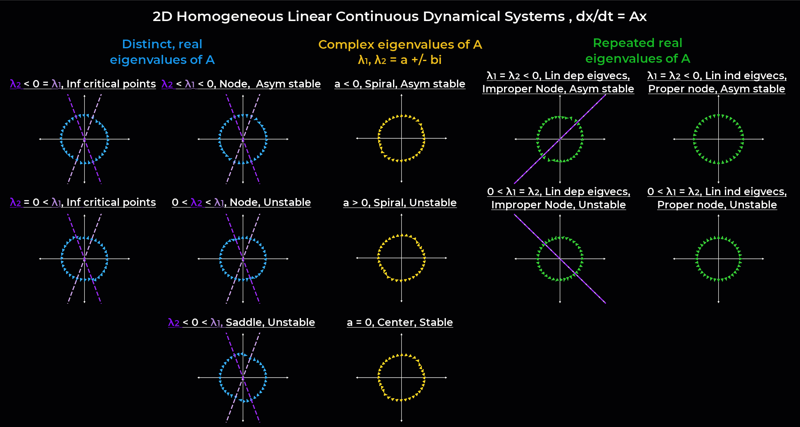

# Key Concepts

## Differential equations
*  Equations that relate functions and their derivatives ($\frac{dx}{dt} = F(x, t)$)
* Can sometimes compute the analytical solution $x(t)$ by integration and solving for constants using the initial condition. This is not always possible.
* Can numerically approximate specific trajectories (corresponding to different initial conditions) using Euler's method, which is based on the update rule
$$ x(t+\Delta t) = F(x, t)\Delta t + x(t)$$
* Can understand the system graphically by plotting a direction field (tangent lines on x vs t graph)
* Can also understand the system graphically by plotting $\frac{dx}{dt}$ vs x and analyzing critical/equilibrium points
* Critical/equilbrium points occur at x for which $\frac{dx}{dt} = 0$. They are either stable (attractors) or unstable (repellers) depening on the derivative sign to either side

## Systems of differential equations

